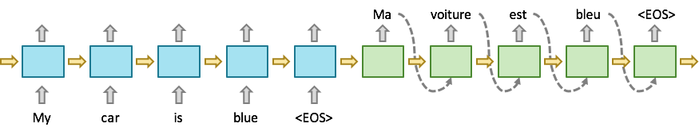
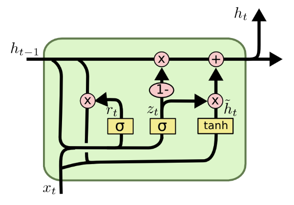
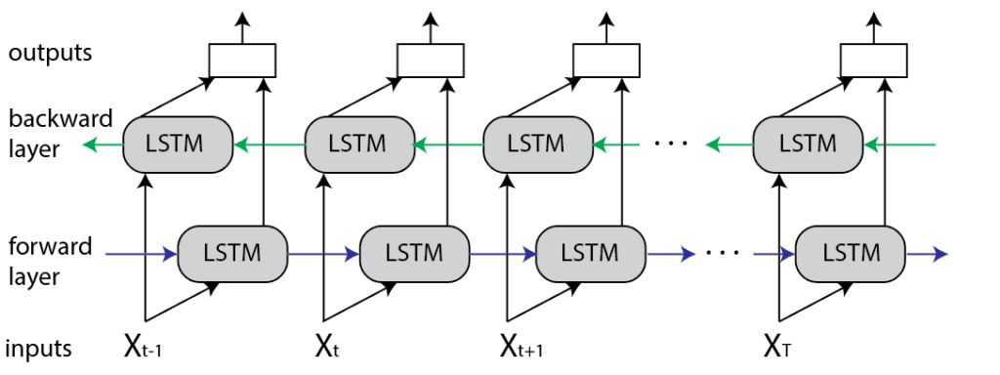

# Recurrent Neural Networks

RNN is designed for modelling sequence data, e.g. time series forecasting, speech recognition, machine translation etc. It can effectively address the following 2 issues with the feedforward neural networks (MLP).

- MLP cannot handle the cases where inputs and outputs have differents lengths.
- MLP do not share features learned across different positions of the examples.

## Mechanism of RNN

- The input data needs to be organised by time steps. The data is fed to the network per time step (such as a token) according to the sequence of data.

- Each RNN cell produces a hidden state for the current time step and an output prediction.
	- *tanh* or *ReLU* are typically used as the activation function.
	- With the tensorflow API, if *return_sequences* is set to True, the output of the RNN layer will be aggregated across all time steps. The dimension of the RNN output will therefore be **(batch_size, timesteps, num_units)**. If *return_sequences* is set to False, only the output of the last RNN cell will be returned. The output dimension will be **(batch_size, num_units)**.

- Four types of RNN
	- One to one: same as the regular NN
	- One to many: e.g. image captioning
	- Many to one: e.g. sentiment analysis
	- Many to many: e.g. machine translation
- Issues with the standard RNN
	- Vanishing gradient
	- Exploding gradient

## LSTM Networks

LSTMs are developed to resolve the long-term dependency problem resulting from vanishing / exploding gradient.

 

- LSTM cell
	- Concat the hidden state of the previous time step and the input data of the current time step.
	- *forget gate*: decides what information to throw away from the cell state.
	- *update gate*: decides what information to store in the cell state, also called *input gate*.
	- Create a vector (tensor) to store the candidate values of the current cell state.
	- Update the cell state of the current time step. *Cell state* serves as the "memory" that gets passed onto future time steps. 
	- *output gate*: decides what gets sent as the predictions (output) of the time step.
		- The output gate is determined by the previous hidden state $h^{t-1}$ and the current input $x^t$.
		- The sigmoid makes the gate range from 0 to 1.
	- Calculate the hidden state to be passed to the LSTM cell's next time step.
		- To be used for determining the forget gate, update gate, and output gate at the next timestep.
		- To be used for determining the prediction of the next time step $y_t$.
$$f_t=\sigma(W_t \cdot [h_{t-1}, x_t]+b_f)$$
$$i_t=\sigma(W_i \cdot [h_{t-1}, x_t]+b_i)$$
$$\widetilde{C}_t=tanh(W_C \cdot [h_{t-1}, x_t]+b_C)$$
$$C_t=f_t*C_{t-1}+i_t*\widetilde{C}_t$$
$$o_t=\sigma(W_o[h_{t-1}, x_t]+b_o)$$
$$h_t=o_t*tanh(C_t)$$
- How does LSTM address the exploding / vanishing gradient problem?

- What is the difference between the cell state and hidden state?
	- cell state: encode the information from all previous time steps
	- hidden state: encode the information of the most recent time step

## Gated Recurrent Unit (GRU)

GRU is a simplied variant of LSTM. It combines the forget and input gates into an update gate, and also merges the cell state and the hidden state.

 

- GRU cell
	- Concat the hidden state of the previous time step and the input data of the current time step.
	- *update gate*: decides how much of the past information (from previous time steps) needs to be passed along to the future.
	- *reset gate*: decides how much of the past information to forget.
	- current memory content: use the reset gate to store the relevant information from the past.
	- final memory for current time step: collect memory from the current and previous time steps separately and sum the results.

$$z_t=\sigma(W_z \cdot [h_{t-1}, x_t])$$
$$r_t=\sigma(W_r \cdot [h_{t-1}, x_t])$$
$$\widetilde{h}_t=tanh(W \cdot [r_t*h_{t-1}, x_t])$$
$$h_t=(1-z_t)*h_{t-1}+z_t*\widetilde{h}_t$$

## Bidirectional LSTM

Bidirectional LSTM enables the input to flow in both directions. Therefore, it allows the network units to capture both past and future information.

BiLSTM adds one more LSTM layer, where the input sequence flows backward. The outputs from both LSTM layers are then combined in several ways, such as average, sum, multiplication, or concatenation. E.g. Pytorch will concat the forward and reverse hidden states at each time step in the sequence when `bidirectional=True`.

BiLSTM is slower than LSTM and requires more time for training.

## References

- Recurrent Neural Network (RNN) Tutorial: Types, Examples, LSTM and More
	- https://www.simplilearn.com/tutorials/deep-learning-tutorial/rnn

- The Unreasonable Effectiveness of Recurrent Neural Networks
	- http://karpathy.github.io/2015/05/21/rnn-effectiveness/

- Understanding LSTM Networks
	- https://colah.github.io/posts/2015-08-Understanding-LSTMs/

- Understanding GRU Networks
	- https://towardsdatascience.com/understanding-gru-networks-2ef37df6c9be

- Differences Between Bidirectional and Unidirectional LSTM
	- https://www.baeldung.com/cs/bidirectional-vs-unidirectional-lstm